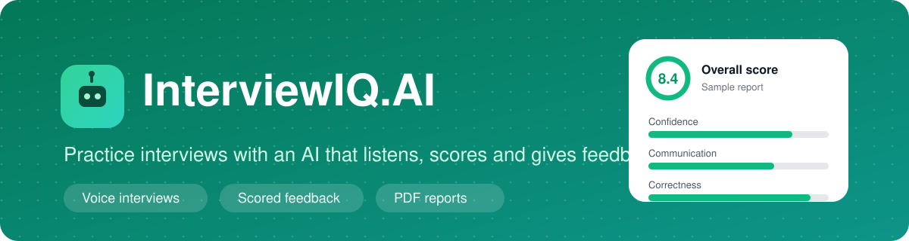
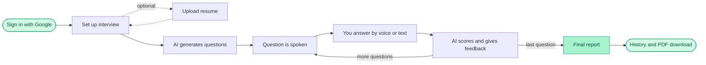
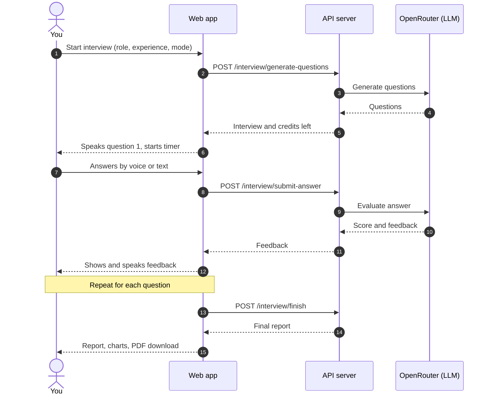
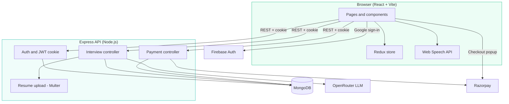

<div align="center">



<br />

**An AI mock-interview platform: answer out loud, get scored, know what to fix.**

[**Live demo**](https://interviewiq-client-rc02.onrender.com) · [Report a bug](../../issues) · [Request a feature](../../issues)


</div>

---

## 🎯 About

InterviewIQ.AI helps job seekers prepare for interviews. Pick a role and experience level (or upload your resume), answer timed questions out loud to an AI interviewer, and finish with a scored report that shows your strengths, weak spots and a per-question breakdown.

## ✨ Features

| | Feature | Details |
| :---: | --- | --- |
| 🔐 | **Google sign-in** | Firebase authentication with a cookie-based session |
| 🧭 | **Role-based setup** | Role and experience input, Technical or HR mode |
| 📄 | **Resume analysis** | Upload a PDF to auto-fill role, experience, projects and skills, and get questions based on your own projects |
| 🎙️ | **Voice interview** | The interviewer speaks each question (speech synthesis) and your answers are transcribed (speech recognition). Typing works too |
| ⏱️ | **Timed questions** | A countdown on every question, with auto-submit when time runs out |
| 💬 | **Instant feedback** | AI feedback after each answer |
| 📊 | **Report dashboard** | Overall score, confidence, communication and correctness ratings, a score trend chart and a per-question breakdown |
| 📥 | **PDF export** | Download the full report |
| 🕘 | **History** | Past interviews with search, filters and sorting |
| 🪙 | **Credits** | Credit packs bought through Razorpay |

## 🔄 How it works



### One question, step by step



## 🏗️ Architecture



## 🧰 Tech stack

| Layer | Technologies |
| --- | --- |
| **Frontend** | React (Vite), React Router, Tailwind CSS, Redux Toolkit, Motion, Recharts, react-circular-progressbar, jsPDF, Axios, Web Speech API |
| **Backend** | Node.js, Express, MongoDB (Mongoose), JWT in HTTP-only cookies, Multer |
| **AI** | OpenRouter (question generation and answer evaluation) |
| **Auth** | Firebase Authentication (Google) |
| **Payments** | Razorpay |
| **Hosting** | Render |

## 📁 Project structure

```
InterviewIQ/
├── client/                      # React app
│   └── src/
│       ├── components/          # Navbar, Footer, Auth, Step1SetUp, Step2Interview, Step3Report, Timer
│       ├── pages/               # Home, InterviewPage, InterviewHistory, Pricing
│       ├── redux/               # userSlice
│       ├── utils/               # firebase.js
│       └── assets/
├── server/                      # Express API
│   ├── config/                  # connectDb, token generation, OpenRouter helper
│   ├── controllers/
│   ├── middleware/              # auth, file upload
│   ├── models/
│   ├── routes/                  # auth, user, interview, payment
│   └── index.js
└── assets/
    └── banner.svg               # README banner
```

Adjust the folder names to match your repository.

## 🚀 Getting started

### Prerequisites

- Node.js 18 or newer
- A MongoDB database (local or Atlas)
- A Firebase project with Google sign-in enabled
- A Razorpay account (test mode works)
- An [OpenRouter](https://openrouter.ai) API key

### Install and run

```bash
git clone <your-repo-url>
cd InterviewIQ

# backend
cd server
npm install
npm run dev          # http://localhost:8000

# frontend (new terminal)
cd client
npm install
npm run dev          # http://localhost:5173
```

## 🔑 Environment variables

> [!IMPORTANT]
> Never commit `.env` files. Make sure `.env` is listed in `.gitignore`, and use the exact variable names your code reads.

<details>
<summary><b>server/.env</b></summary>

| Variable | Description |
| --- | --- |
| `PORT` | Port for the API, for example `8000` |
| `MONGODB_URL` | MongoDB connection string |
| `JWT_SECRET` | Long random string used to sign login tokens |
| `OPENROUTER_API_KEY` | Your OpenRouter API key |
| `CLIENT_URL` | Frontend origin allowed by CORS |
| `RAZORPAY_KEY_ID` | Razorpay key id |
| `RAZORPAY_KEY_SECRET` | Razorpay key secret |

```env
PORT=8000
MONGODB_URL=<your-mongodb-connection-string>
JWT_SECRET=<a-long-random-string>
OPENROUTER_API_KEY=<your-openrouter-api-key>
CLIENT_URL=http://localhost:5173
RAZORPAY_KEY_ID=<your-razorpay-key-id>
RAZORPAY_KEY_SECRET=<your-razorpay-key-secret>
```

</details>

<details>
<summary><b>client/.env</b></summary>

| Variable | Description |
| --- | --- |
| `VITE_RAZORPAY_KEY_ID` | Razorpay key id (public key only) |
| `VITE_FIREBASE_API_KEY` | Firebase web API key |

Add the rest of your Firebase config values using the names in your `firebase.js`.

</details>

## 🔌 API reference

All routes are under `/api`. Protected routes read the JWT from the `token` cookie.

| Method | Endpoint | Auth | Description |
| :---: | --- | :---: | --- |
| `POST` | `/auth/google` | – | Sign in with Google and set the session cookie |
| `GET` | `/auth/logout` | – | Clear the session cookie |
| `POST` | `/interview/resume` | ✅ | Upload a PDF (form field `resume`) and extract role, experience, projects and skills |
| `POST` | `/interview/generate-questions` | ✅ | Create an interview and generate questions. Uses credits |
| `POST` | `/interview/submit-answer` | ✅ | Submit an answer and get feedback |
| `POST` | `/interview/finish` | ✅ | Finish the interview and build the final report |
| `GET` | `/interview/get-interview` | ✅ | List the signed-in user's interviews |
| `POST` | `/payment/order` | ✅ | Create a Razorpay order for a credit pack |
| `POST` | `/payment/verify` | ✅ | Verify the payment signature and add credits |

<details>
<summary><b>Test with curl</b></summary>

```bash
# sign in and save the cookie
curl -i -c cookies.txt -X POST http://localhost:8000/api/auth/google \
  -H "Content-Type: application/json" \
  -d '{"name":"Test User","email":"test@example.com"}'

# call a protected route with the saved cookie
curl -b cookies.txt http://localhost:8000/api/interview/get-interview
```

</details>

## 🏅 Scoring and credits

### Score bands

| Score | Result | |
| :---: | --- | --- |
| **8 – 10** | Ready for job opportunities | 🟢 |
| **5 – 7** | Needs minor improvement before interviews | 🟡 |
| **Below 5** | Significant improvement required | 🔴 |

Each report also rates **confidence**, **communication** and **correctness** out of 10, with a score and feedback for every question.

### Credit packs

| Plan | Price | Credits |
| --- | :---: | :---: |
| Free | ₹0 | 100 |
| Starter Pack | ₹100 | 150 |
| Pro Pack | ₹500 | 650 |

## ☁️ Deployment

The frontend and backend are deployed as separate services on Render.

| Service | Type | Build | Start / publish |
| --- | --- | --- | --- |
| Backend (`server/`) | Web Service | `npm install` | `npm start` |
| Frontend (`client/`) | Static Site | `npm install && npm run build` | publish `dist` |

1. Add the environment variables to each service.
2. Set `CLIENT_URL` on the backend to the exact frontend URL, with no trailing slash.
3. Free Render services sleep when idle, so the first request can take 30 to 60 seconds.

## 🩺 Troubleshooting

<details>
<summary><b>"user does not have a token" after signing in</b></summary>

The frontend and backend are on different `onrender.com` subdomains, so the login cookie is a third-party cookie and some browsers block it. In DevTools, open the Network tab and hover the warning icon next to `Set-Cookie` on the `/auth/google` response to confirm.

- Set the cookie with `httpOnly: true`, `secure: true` and `sameSite: "none"`.
- Allow the exact frontend origin in CORS with `credentials: true`.
- For a reliable fix, make both parts one site: add a Render **Rewrite** rule from `/api/*` on the frontend to the backend URL and set the client `ServerUrl` to an empty string, or use a custom domain with `app.` and `api.` subdomains.

</details>

<details>
<summary><b>Resume upload returns 400</b></summary>

Check the response body for the message. Make sure the form field name is `resume`, the route uses the upload middleware, and the PDF contains selectable text (scanned image PDFs can't be read).

</details>

<details>
<summary><b>AI requests fail or return empty results</b></summary>

Check that `OPENROUTER_API_KEY` is set on the server, the key has credit, and the model you configured is available on OpenRouter. Look at the server logs for the error returned by OpenRouter.

</details>

<details>
<summary><b>Voice features don't work</b></summary>

Speech recognition uses the browser's Web Speech API and works best in Chrome and Edge. The page must be served over HTTPS or `localhost`, and the browser needs microphone permission.

</details>

<details>
<summary><b>Payment popup doesn't open</b></summary>

Confirm the Razorpay checkout script is loaded in `index.html` and `VITE_RAZORPAY_KEY_ID` is set. Test-mode keys only work with test-mode payments.

</details>

> [!WARNING]
> Keep `OPENROUTER_API_KEY`, `JWT_SECRET` and `RAZORPAY_KEY_SECRET` on the server only, work out plan prices on the server, and verify the Firebase ID token before signing a user in. Set a spending limit on your OpenRouter key.

## 🗺️ Roadmap

- [x] Google sign-in
- [x] Resume-based questions
- [x] Voice interview with timer
- [x] Scored report and PDF export
- [x] Credits and Razorpay payments
- [ ] Email and password sign-in
- [ ] More interview modes and role templates
- [ ] Shareable report links
- [ ] Dark mode
- [ ] Follow-up questions based on your previous answer

## 🤝 Contributing

1. Fork the repository
2. Create a branch: `git checkout -b feature/your-feature`
3. Commit your changes: `git commit -m "Add your feature"`
4. Push the branch: `git push origin feature/your-feature`
5. Open a pull request

For larger changes, please open an issue first to discuss what you would like to change.

## 👤 Author

**<Your Name>**

[GitHub](https://github.com/your-username) · [LinkedIn](https://linkedin.com/in/your-profile)

## 📄 License

Distributed under the MIT License. Add a `LICENSE` file if you choose this license.

<div align="center">

If this project helped you, consider giving it a ⭐

</div>
